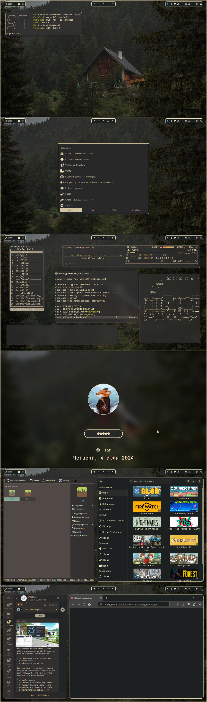

## 🖥️ My Hyprland desktop
I'm using openSUSE, I'm not going to leave it. 3k+ packages and it's fine, I don't care about minimalism. I had BSPWM before, but I figured out why I was getting a hard time with it. 
### 💾 How to install
- ```git clone https://github.com/SophrTemin/MyHypr```
- ```cd MyHypr```
- ```cp -r -v .config .themes ~/.config/```
- ```chmod +x +R ~/.config*```
---
- ```cp -r -v grub-gruvbox /etc/grub/themes/```
- setting grub.cfg in /etc/default/grub
- ```sudo grub-mkconfig -o /boot/grub/grub.cfg```
# Enjoy!

