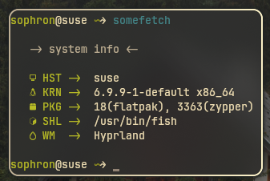

## 🖥️ My Hyprland desktop
I'm using openSUSE, I'm not going to leave it. 3k+ packages and it's fine, I don't care about minimalism. I had BSPWM before, but I figured out why I was getting a hard time with it. 

## Other themes
- Telegram theme: [click](https://t.me/addtheme/gruvmaterialdark)
- VKontakte theme: [click](https://vk.com/2style#WyIxMDAsLDE1LjcsMTAwfDg4LDU4LjgsODEsNTB8OTQuNCwzLjEsMTksMTAwfDg2LjUsODYuNyw4OC4yLDEwMHx8fDg4LjgsMzguMiw3My4zLDEwMHw4OCw1OC44LDgxLDEwMHw4Ni41LDg2LjcsODguMiwxMDB8fHx8fHx8fDEwMCwsMjguNiwxMDAiLCJQT0pXQWk0blduVGZfc3gxSUZxcXpwYm9JcldKSlpVQUl4QjZxeEEvM3JiU0ZkZ0xhc0EuanBnIiwidmsuY29tL3ZpZGVvLTE2ODg3NDYzNl80NTYyNDMxNDYmdGh1bWI9UGM4NTIxMjQvdjg1MjEyNDczNC9iNGUxNy9fSVhYWVhZelVQWS5qcGcsIHZrLmNvbS92aWRlby0xNjg4NzQ2MzZfNDU2MjM5MDQxJnRodW1iPVBjODQ3MTIwL3Y4NDcxMjA2ODYvZWE2YzMvNHlJV2JTYzY4SjAuanBnLCB2ay5jb20vdmlkZW8tMTY4ODc0NjM2XzQ1NjI0MTI4MSZ0aHVtYj1QYzg1MDUyOC92ODUwNTI4MTkzL2FlMTY4L0N1amFvenpLOTl3LmpwZywgdmsuY29tL3ZpZGVvLTE2ODg3NDYzNl80NTYyMzk1MjgmdGh1bWI9UGM4NDY1MjQvdjg0NjUyNDk4MC8xNDM5NGIvQlJDZDdiM0ZJZk0uanBnLCB2ay5jb20vdmlkZW8tMTY4ODc0NjM2XzQ1NjIzOTAyOCZ0aHVtYj1QYzg1MDIyOC92ODUwMjI4MjA3LzExMjBiL3kxSGFLX3htc3JNLmpwZywgdmsuY29tL3ZpZGVvLTE2ODg3NDYzNl80NTYyNDEzMzUmdGh1bWI9UGM4NDcyMjEvdjg0NzIyMTY5OC8xYTI1YjAvRlcwNG5LaGFud2suanBnLCBQU1JXZEZ3blZnX29yV0ZIeDNHa05nT3JhYkJsWDFvZTJjMG1pMWcvNzlKNmd1LXdvUjguanBnLCBQMEZDd0Zua0k3UFpKdkVHZV9jZk5lLXpNZWdBQWpneVNpU1hqQXcvOW1fN0pmcU9JX1EuanBnIiwiSmV0QnJhaW5zTW9ub05lcmQiLDIsMiwyLCwsLDIsMiwsLCwxLDEsMSwyLCIxICAyMCAyMCAwIDEwIiwyXQ)
- Prism Launcer theme: [click](https://github.com/SophrTemin/Gruvbox-PrismLauncher)
- Somefetch: [click](https://github.com/UnixAwesomes/somefetch)

### 💾 How to install
- ```git clone https://github.com/SophrTemin/MyHypr```
- ```cd MyHypr```
- ```cp -r -v .config .themes ~/.config/```
- ```chmod +x +R ~/.config*```
---
- ```cp -r -v grub-gruvbox /etc/grub/themes/```
- setting grub.cfg in /etc/default/grub
- ```sudo grub-mkconfig -o /boot/grub/grub.cfg```

## Pallete


## Custom somefetch(I have a binary, and it's custom.)


# Enjoy! (this video)
[](https://www.youtube.com/watch?v=5vZkjzK7VmQ)

# Updates

**15/07 - changed repo name**

**16/07 11:00 - added config mako and add line exec-once in hyprland.conf**

**16/07 12:30 - added power menu option, bind and volume binds. Deleted latest power binds**

**17/07 - Added vesktop/other theme and added Pallete table for README.md**

**18/07 - Added somefetch(fastfetch remains)**

**18/07 - Added png somefetch**

**18/07 - Added mako option icon-path**

**18/07 - Added padding for kitty(foot coming soon...)**
